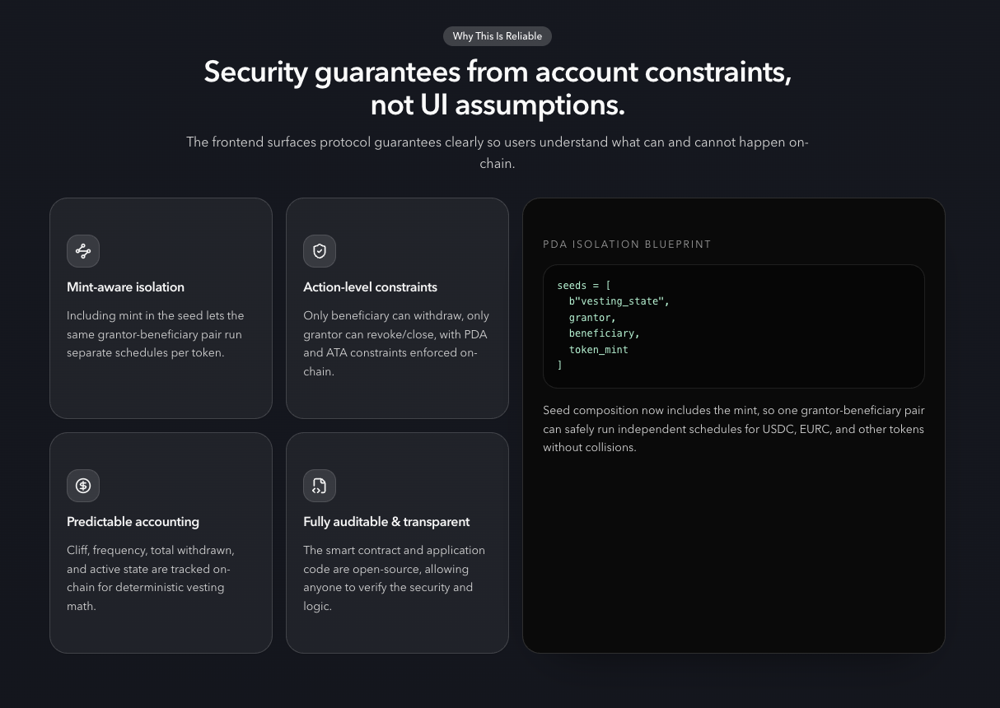
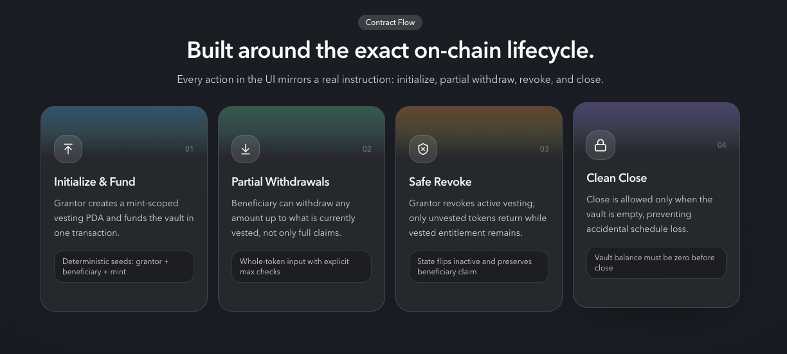
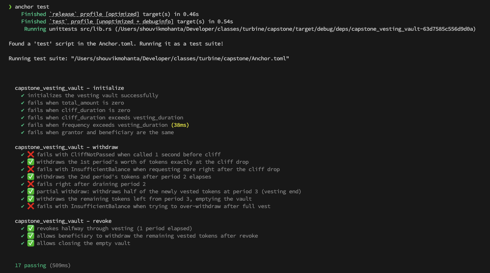

# Capstone Vesting Vault

**Deployed Program ID (Devnet):** [`AD8rbtNK1GW3u6yVJxr3zGKf2hhTuGs9zCmsidhpR982`](https://explorer.solana.com/address/AD8rbtNK1GW3u6yVJxr3zGKf2hhTuGs9zCmsidhpR982?cluster=devnet)

A Solana-based token vesting application built using the Anchor framework and React. This project enables organizations (grantors) to create customizable token vesting schedules for employees, investors, or other stakeholders (beneficiaries), ensuring a secure and structured release of tokens over time.

## Project Structure

The repository is modularized into two primary parts:
1. **Smart Contracts (`programs/capstone_vesting_vault`)**: Contains the Solana on-chain logic written in Rust using the Anchor framework.
2. **Frontend (`app/src`)**: A React application that provides an intuitive user interface to interact with the vesting schedules.

## Features



### Smart Contract functionality
The on-chain program provides the following core instructions:



- **Initialize**: Create a new vesting schedule with configurable parameters (start time, cliff time, vesting duration, total amount, and release frequency). The tokens are securely locked inside a Vault.
- **Withdraw**: Beneficiaries can seamlessly claim their unlocked (vested) tokens at any time after the cliff period has passed. Partial withdrawals are tracked on-chain.
- **Revoke**: Grantors have the ability to explicitly revoke an active vesting schedule, recovering the remaining unvested tokens.
- **Close**: Close fully withdrawn or revoked vesting schedules to reclaim account rent.

### Frontend functionality
The web application offers a polished, responsive dashboard to manage vesting distributions:
- **Wallet Connection**: Connect Phantom or other standard Solana wallets.
- **Overview Dashboard**: Easily view high-level metrics including:
  - Total Allocated Tokens
  - Tokens Available to Claim
  - Number of Active Schedules (as a Grantor or Beneficiary)
- **Schedule Management**: Iterate through all active vesting schedules associated with the connected wallet. Detailed cards display token amounts, cliff times, vesting duration, and precise intervals.
- **Claiming**: One-click actions to withdraw available vested tokens directly to the user's wallet.
- **Create Schedule Dialog**: Easily initialize new vesting vaults for given beneficiaries through a simplified user interface form.

## Technology Stack

- **Blockchain**: Solana, Anchor Framework, Rust
- **Frontend**: React, TypeScript, Vite, Tailwind CSS, shadcn/ui components
- **Wallet Integration**: `@solana/wallet-adapter-react`

## Getting Started

### Prerequisites

Ensure you have the following installed on your machine:
- Node.js & Yarn
- Rust (Cargo)
- Solana CLI
- Anchor CLI

### Smart Contract Deployment

1. Navigate to the project root directory.
2. Build the Anchor program:
   ```bash
   anchor build
   ```
3. Run tests against your local validator or standard test setup:
   ```bash
   anchor test
   ```

Below is the execution result of the full Devnet test lifecycle:



4. Deploy the program to your target cluster (e.g., localnet, devnet):
   ```bash
   anchor deploy
   ```

### Frontend Setup

1. Navigate to the `app` directory:
   ```bash
   cd app
   ```
2. Install dependencies:
   ```bash
   npm install
   # or yarn install
   ```
3. Run the development server:
   ```bash
   npm run dev
   # or yarn dev
   ```
4. Open the displayed local server URL in your browser to start interacting with the Vesting application.

## Usage Guide
1. **Connect Wallet**: Start by clicking the connect button to establish a session with the dApp.
2. **Create Schedule**: If you are a grantor, open the "Create Schedule" dialog and enter the specified beneficiary public key, token identifiers, vesting schedules (start time, cliff time, duration, and frequency), and amounts. Submit the transaction.
3. **Claim Tokens**: If you are a beneficiary of an incoming vesting schedule, the main dashboard will calculate what tokens are currently unlocked based on your schedule's cliff period and frequency. Simply select "Claim" on the respective schedule tile.
